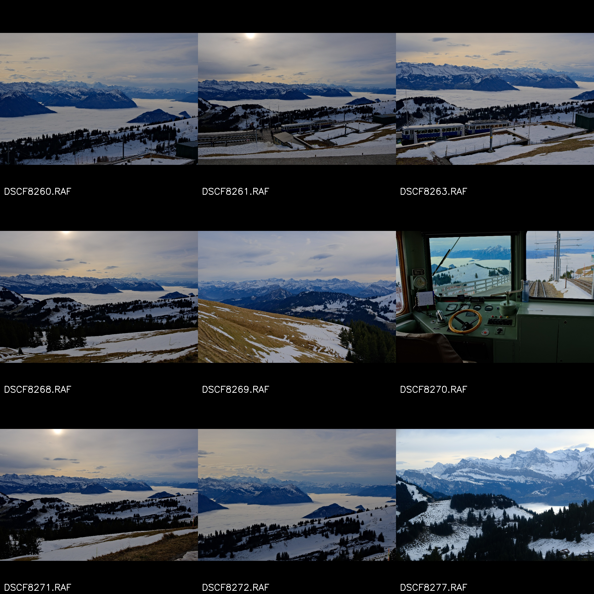
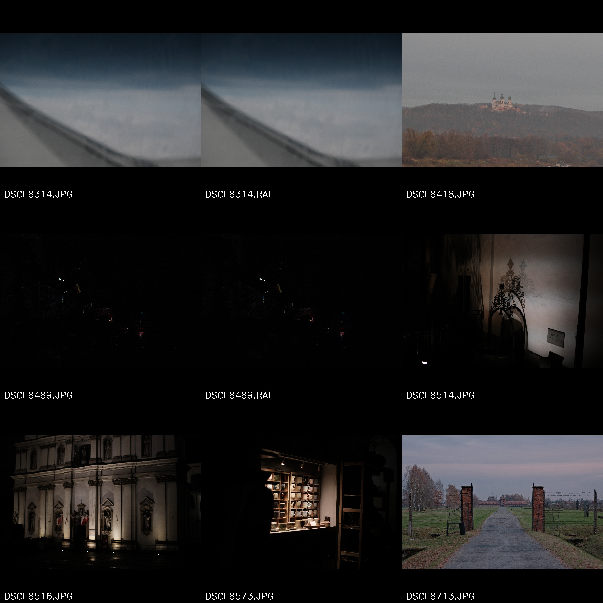

# 📸 AI Photography Culling Suite (v1.0)
### by Ramazan Ertuğrul Aydoğan


A high-performance automated culling tool designed for photographers. 

Sorts thousands of photos in minutes based on **Sharpness**, **Exposure**, and **Subject Content** (Humans vs. Animals vs. Landscapes) using hardware-accelerated AI and OpenCV grid analysis.

---

## 🚀 Key Features & Logic

### 🧠 Smart Analysis
*   **"Donut-Hole" Sharpness:** Basic tools mark photos with "Bokeh" (blurry backgrounds) as out of focus. This tool uses AI bounding boxes to check if the **Subject** is sharp, ignoring the background blur entirely.
*   **Smart Exposure:** Uses 95th Percentile Highlight detection. It intelligently differentiates between an accidentally "Underexposed" photo and an "Artistic Silhouette" or sunset.
*   **Content Awareness:** Automatically separates Portraits, Wildlife, and Landscapes into their own sub-directories.

### ⚡ Engineering & Performance
*   **Universal RAW Support:** Zero-lag preview extraction. Instead of doing heavy RAW demosaicing, the script uses `rawpy` to instantly extract the embedded high-res JPEGs from the RAW files.
*   **State Persistence:** Uses an SQLite database (`sort_progress.db`) to track progress. Crashed? Power outage? Simply restart the script and it resumes exactly where it left off.
*   **Benchmark Mode:** Generates high-res 3x3 (2400px) contact sheets to let you quickly verify the AI's sorting decisions visually.

---

## 🖼️ Project Visuals



*Generated 3x3 high-resolution contact sheet for visual verification.*

---

## 📷 Supported Cameras
The tool safely supports virtually all major camera formats via `rawpy` extraction and OpenCV fallbacks:

| Brand | Extensions |
| :--- | :--- |
| **Canon** | .CR2, .CR3 |
| **Sony** | .ARW |
| **Nikon** | .NEF |
| **Fujifilm** | .RAF |
| **Olympus** | .ORF |
| **Generic** | .DNG, .JPG, .PNG |

---

## 📂 Output Folder Structure
The script safely moves your processed files into a clean hierarchy without deleting any original files:

```text
Final_Smart_Sort_v5/
├── Human/
│   ├── Sharp_Portrait/      (Keepers)
│   ├── Artistic_Dark/       (Check manually)
│   └── Blurry_Discard/      (Reject)
├── Animal/
│   ├── Sharp/               (Keepers)
│   └── Blurry_Discard/      (Reject)
└── Landscape/
    ├── Sharp_Detail/        (Keepers)
    ├── Artistic_LowLight/   (Keepers)
    └── Blurry_Discard/      (Reject)
```

---

## ⚠️ Hardware Performance & Acceleration

The script automatically detects your hardware and assigns the AI workload accordingly:

*   **NVIDIA GPU (CUDA):** Highly recommended. Processing takes fractions of a second per image.
*   **CPU Only:** Fully supported, but slower (~1-3 seconds per image depending on CPU generation).
*   **Memory:** Highly optimized. It processes files sequentially and clears memory instantly, preventing RAM bottlenecks.

---

## 🛠️ Installation & Usage

### 1. Setup

Clone the repository and install the required Python libraries:

```bash
git clone https://github.com/Erusuru/AI-photo-sorter.git
cd AI-photo-sorter
pip install -r requirements.txt
```

### 2. Run the Tool
   
```bash
python imagesort_fast.py
```

### 3. Terminal Interface

Follow the on-screen CLI menu to:

*   **AI Image Sorting:** Choose a directory (or multiple custom paths) to begin the automated sorting process.
*   **Benchmark Grids:** Generate contact sheets for folders that have already been sorted.

---


